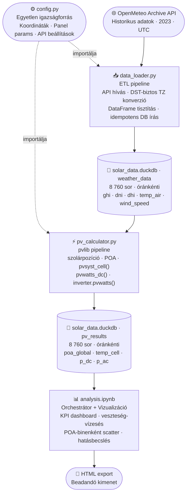

<a id="teteje"></a>

# Solar ETL & Simulation Project 
> (`solar-etl-simulation`)

<p align="center">
  
  
  
  
  
  
</p>

<p align="center">
  <a href="#attekintes">Áttekintés</a> &bull;
  <a href="#architektura">Architektúra</a> &bull;
  <a href="#parameterek">Paraméterek</a> &bull;
  <a href="#megvalasztott">Megválasztott értékek</a> &bull;
  <a href="#setup">Setup</a> &bull;
  <a href="#struktura">Struktúra</a> &bull;
  <a href="#dontes">Technikai döntések</a> &bull;
  <a href="#kihivas">Kihívások</a> &bull;
  <a href="#kapcsolat">Kapcsolat</a>
</p>

<p align="center">
  ☀️ Napenergia ETL és szimulációs pipeline – OpenMeteo-tól az éves termelési becslésig.
</p>

---

<a id="attekintes"></a>
## Áttekintés

Ez a projekt egy adatmérnöki és energetikai szimulációs feladat megvalósítása. A cél egy Python alapú pipeline felépítése, amely meteorológiai adatokat tölt le, majd ezek alapján kiszámítja egy specifikus napelempark éves energiatermelését a 2023-as évre vonatkozóan.

A projekt három komponensből és egy analitikai notebookból áll:

1. **ETL Komponens** (`data_loader.py`): Historikus időjárási adatok (irradiancia, hőmérséklet, szélerősség) kinyerése az OpenMeteo API-ból, és legalább órás felbontású tárolása egy lokális DuckDB analitikus adatbázisban (`solar_data.duckdb`).
2. **Szimulációs Komponens** (`pv_calculator.py`): A `pvlib` könyvtár segítségével a napelempark (10 db 400 Wp Trina Solar Vertex S DE09.08 panel, 18 fokos dőlésszög, 5 kW max. inverter) éves energiatermelésének modellezése az adatbázisból kinyert adatok alapján.
3. **Analitikai Komponens** (`analysis.ipynb`): Az eredmények vizualizációja és statisztikai elemzése interaktív Jupyter notebookban. A notebook egyben az orchestrátor is: sorban meghívja az ETL és szimulációs függvényeket, majd megjeleníti az eredményeket. Tartalmaz egy üzleti és környezeti hatásbecslő szekciót is, amely a szimulált éves termelést 2023-as dokumentált áramár- és CO₂-emissziós adatok alapján pénzügyi megtakarítássá és kiváltott szén-dioxid-mennyiséggé fordítja le.

---

<a id="architektura"></a>
## Architektúra



---

<a id="parameterek"></a>
## Napelem Park Paraméterei

| Paraméter | Érték | Forrás |
|---|---|---|
| Panel típus | Trina Solar Vertex S TSM-400 DE09.08 | Adatlap |
| Névleges teljesítmény | 400 Wp / panel | Adatlap (STC) |
| Panelek száma | 10 db | Feladat |
| Összes DC teljesítmény | 4 000 Wp | Számított |
| Modul hatásfok | 20,8 % | Adatlap |
| Hőmérsékleti együttható | -0,34 %/K | Adatlap |
| Dőlésszög | 18° | Feladat |
| Tájolás | 180° (dél) | Feltételezett |
| Inverter max. teljesítmény | 5 000 W | Feladat |
| Inverter hatásfok | 96 % | Iparági tipikus |

---

<a id="setup"></a>
## Telepítés és Futtatás (Setup)

### Opció 1: Conda környezet (Ajánlott)

```bash
# Környezet létrehozása (csak az első alkalommal)
conda env create -f environment.yml

# Környezet aktiválása
conda activate solar_env
```

### Opció 2: Standard Python (venv + pip)

```bash
python -m venv venv

# Windows:
venv\Scripts\activate
# Linux / macOS:
source venv/bin/activate

pip install -r requirements.txt
```

### Futtatás

A projekt futtatásához kizárólag a notebookot kell megnyitni és cellánként végrehajtani:

```bash
jupyter notebook analysis.ipynb
```

A notebook sorban elvégzi az adatletöltést, az adatbázisba írást, a pvlib szimulációt, majd megjeleníti az összes vizualizációt és statisztikát. Külön `.py` fájlt kézzel futtatni nem szükséges.

A kész notebookot HTML formátumban lehet exportálni a vizualizációk kimenetével együtt:
**File → Save and Export Notebook As → HTML**

---

<a id="struktura"></a>
## Projekt Struktúra

<pre>
solar-etl-simulation/
├── <a href="config.py">config.py</a>           # Minden konstans egy helyen (koordináták, panel params, API beállítások)
├── <a href="data_loader.py">data_loader.py</a>      # 1. komponens: OpenMeteo API → DuckDB ETL pipeline
├── <a href="pv_calculator.py">pv_calculator.py</a>    # 2. komponens: DuckDB → pvlib → éves energiatermelés
├── <a href="analysis.ipynb">analysis.ipynb</a>      # 3. komponens + orchestrátor: vizualizáció, statisztikák, hatásbecslés
├── tests/
│   └── <a href="tests/_test_duckdb.py">_test_duckdb.py</a>  # Integrációs tesztszkript: ETL + pvlib pipeline ellenőrzése
├── solar_data.duckdb   # 🚨 Generált DuckDB adatbázis (gitignore-ban, nem verziókövetett)
├── environment.yml     # Conda függőségek (verziópinelt)
├── requirements.txt    # pip függőségek (verziópinelt)
├── .python-version     # Python verzió rögzítése (3.10.20)
├── .gitignore          # Adatbázis, cache, képfájlok, IDE fájlok kizárása
└── README.md
</pre>

**Konfiguráció elvének magyarázata:** minden "magic number" és beállítás a `config.py`-ban van definiálva, adatlapra hivatkozó kommentekkel. A többi modul ebből importál, így a rendszer egy helyen auditálható és módosítható.

---

<a id="megvalasztott"></a>
## Megválasztott Alapértelmezett Értékek

A feladat nem határozza meg a napelem park összes paraméterét. Az alábbiak azok az értékek, amelyeket mi választottunk az adatlap, az iparági gyakorlat vagy a magyar/közép-európai viszonyok alapján:

### Helyszín és meteorológia

| Paraméter | Érték | Indoklás |
|---|---|---|
| **Város** | Budapest, Infopark E épület | Az interjú helyszíne (feladatból) |
| **Földrajzi koordináták** | 47,47°N / 19,06°E / 109 m | WGS84; Infopark E épület (ismert cím) |
| **Időzóna** | Europe/Budapest (UTC+1/+2) | Magyarország zónája |
| **Meteorológiai adatok** | OpenMeteo Archive API, UTC | Nyílt forráskódú, ingyenes, DST-biztos, óránkénti felbontás |
| **Év** | 2023 | Feladatbeli megadás |

### Napelem park mechanikai paraméterei

| Paraméter | Érték | Indoklás |
|---|---|---|
| **Dőlésszög (tilt)** | 18° | Feladatbeli megadás |
| **Tájolás (azimuth)** | 180° (déli) | A feladat nem adta meg. Az elméleti maximumhoz a déli tájolást vettük alapul. *Interjú-megjegyzés:* Egy lapostetős irodaházon a valóságban szinte mindig Kelet-Nyugati tájolást alkalmaznak a jobb helykihasználás miatt, de az egyszerűbb modellezés kedvéért maradt az elméleti déli irány. |
| **Szerelési mód** | Lapostetős (ballasztos/lesúlyozott) | A feladat specifikusan az interjú helyszínét (Infopark E) adta meg, ami egy többszintes irodaház. A talajra telepített (freestanding) rendszer itt fizikailag értelmezhetetlen, a modellezés során lapostetős telepítéssel és az ebből fakadó gyengébb szellőzési paraméterekkel kell számolni. |

### Napelem paraméterek (Trina Solar Vertex S TSM-400 DE09.08, adatlap-alapú)

| Paraméter | Érték | Indoklás |
|---|---|---|
| **Modul típusa** | Trina Solar Vertex S TSM-400 DE09.08 | Feladatban megadott adatlap linkből |
| **Névleges teljesítmény** | 400 Wp / panel | Adatlap (STC: 1000 W/m², 25 °C, AM 1.5) |
| **Panelek száma** | 10 db | Feladatbeli megadás |
| **Össz DC teljesítmény** | 4 000 Wp (4 kWp) | 10 × 400 = 4 000 W |
| **Modul hatásfok** | 20,8% (η_m) | Adatlap (TSM-400 sor, "Module Efficiency ηm") |
| **Hőmérsékleti együttható** | −0,34 %/K (γ_pdc) | Adatlap (teljesítmény hőmérsékleti függése) |

### Cellahőmérséklet modellezés (pvlib.temperature.pvsyst_cell)

| Paraméter | Érték | Indoklás |
|---|---|---|
| **Hőveszteségi tényező (konstans rész)** | U_c = 26,744 W/m²/K | Adatlapból levezetett (NOCT = 43 °C): `U_c = poa × (1 − η_m/α) / (T_NOCT − T_air) = 800 × 0,769 / 23 = 26,744 W/m²/K` |
| **Hőveszteségi tényező (szél-függő)** | U_v = 0,0 Ws/m³/K | **Fizikai realitás az épületen.** Egy lapostetőn, ballasztos szerkezettel telepített rendszernél a szél hűtőhatása minimális az alákapást gátló aerodinamikai burkolatok miatt. Az U_v=0 érték reálisan szimulálja a tetőn rekedő hőt és a gyengébb szellőzést. |
| **Elnyelt sugárzás aránya** | α = 0,9 | pvlib alapértelmezés (tipikus szilícium panel) |
| **STC referencia hőmérséklet** | 25 °C | Iparági szabvány (STC: Standard Test Conditions) |

### Inverter paraméterek

| Paraméter | Érték | Indoklás |
|---|---|---|
| **Maximális AC teljesítmény** | 5 000 W (5 kW) | Feladatbeli megadás |
| **DC bemeneti teljesítmény max.** | 5 000 W | Az inverter maximális AC-hez szükséges minimum DC bemenet; pvlib.inverter.pvwatts paraméter. |
| **Inverter Loading Ratio (ILR)** | 4 000 / 5 000 = **0,80** | Jellemzően 1,0–1,3 között van (túlterhelés engedélyezése miatt). Az ILR=0,80 kissé alulterhelt inverter, de konzervatív választás. |
| **Névleges inverter hatásfok** | 96,0% | Iparági tipikus érték (95–97% a szokásos tartomány) |
| **PVWatts referencia hatásfok** | 96,37% | pvlib.inverter.pvwatts függvény alapértelmezése; ennek használata mellett módosítható az ETA_INV_NOM |

### POA (Plane of Array) irradiancia dekompozíciós modell

| Paraméter | Érték | Indoklás |
|---|---|---|
| **Dekompozíciós modell** | haydavies | Körülötte circumsolar sugárzás (gyűrű a Nap körül) és horizont fényerősödés. Budapest kontinentális, részben felhős égboltra pontosabb az isotropic-nál; a Perez modellnél egyszerűbb (1–3% éves eltérés, interjúfeladat-szinten nem indokolt). |
| **Extraterrestris normál irradiancia** | `pvlib.irradiance.get_extra_radiation(index)` | Nap–Föld távolság alapján számított (hozzávetőlegesen 1361 W/m², szinusz-válto módosítás) |

### Rendszerveszteség modell (NREL PVWatts standard)

A veszteségek **multiplikatívan** hatnak: `derate_factor = ∏(1 − loss_i)` ≈ **0,8679**, teljes veszteség **~13,21%**.

| Komponens | Érték | Indoklás |
|---|---|---|
| **Koszolódás (soiling)** | 2,0% | NREL PVWatts v5 alapérték; 2023 európai városok félszennyezett légköre (sem sivatag, sem szélsőségesen tiszta) |
| **Árnyékolás (shading)** | 3,0% | NREL PVWatts v5 alapérték; a 3% még árnyékolásmentesnek mondott rendszereknél is fedezi a horizont-takarást (távoli épületek, dombok). |
| **Modul-eltérés (mismatch)** | 2,0% | NREL PVWatts v5 alapérték; gyártási eltérés azonos típusú panelek között is jelen van (±3% adatlap-szórás). |
| **DC kábelezés (wiring)** | 2,0% | NREL PVWatts v5 alapérték; DC oldali ellenállási veszteségek a panelek és az inverter között. |
| **Csatlakozási veszteség (connections)** | 0,5% | NREL PVWatts v5 alapérték; kábelvégek, biztosítékok, megszakítók kontakt-ellenállása. |
| **Fény okozta degradáció (LID)** | 1,5% | NREL PVWatts v5 alapérték; az első üzemévben jellemző ~0,3–0,8%, konzervatív felső becslés. |
| **Névleges telj.-eltérés (nameplate)** | 0,0% | Adatlap: 0/+5 W tolerancia – a panel STC-n sosem teljesít a névleges 400 W alá; e veszteség nem releváns. |
| **Rendelkezésre állás + karbantartás (availability)** | 3,0% | NREL PVWatts v5 alapérték; inverter- és rendszer-leállások (ütemezett és vészhelyzeti karbantartások). |
| Hó (snow) | 0,0% | NREL PVWatts v5 alapérték; nem szerepel a derate-ben. |
| Életkor (age) | 0,0% | NREL PVWatts v5 alapérték; nem szerepel a derate-ben. |
| **Teljes derate faktor** | ~86,79% | Multiplikatív (nem additív): (1−0,02)(1−0,03)(1−0,02)²(1−0,005)(1−0,015)(1−0,03) |

### Adatbázis és technológia

| Paraméter | Érték | Indoklás |
|---|---|---|
| **Adatbázis motor** | DuckDB (`solar_data.duckdb`) | Column-oriented, fájlalapú, deployment-mentes — ugyanolyan egyszerű mint a SQLite, de az analitikai workload-ra optimalizált. Natív `TIMESTAMPTZ` típus, közvetlen DataFrame I/O, SQLite scanner a migrációhoz. |
| **Python verzió** | 3.10+ | Modern asyncio / walrus operator support; a dependencies (pvlib, pandas, duckdb) mind támogatják. |
| **pvlib verzió** | 0.15.1+ | Stabil; tartalmazza a pvsyst_cell (module_efficiency paraméter), haydavies modell és az összes szükséges függvényt. |

---

<a id="dontes"></a>
## Technikai Döntések és Indoklások

### POA irradiancia modell: `haydavies`

| Modell | Szórt sugárzás kezelése | Pontosság | Komplexitás |
|---|---|---|---|
| `isotropic` | Egyenletes égbolteloszlás | Alacsonyabb, felhős égboltnál | Minimális |
| **`haydavies`** | **Circumsolar + horizont fényerősödés** | **Közepes-jó** | **Mérsékelt** |
| `perez` | Teljes anizotrop empirikus modell | Legjobb | Magas |

Budapest kontinentális éghajlatán a `haydavies` pontosabb az `isotropic`-nál. A `perez`-zel szemben az éves energiahozam szintjén várható eltérés 1–3%, ami nem indokolja a plusz komplexitást.

### Tájolás (Azimuth): 180° (dél)

A feladat nem adja meg a panelek tájolását. Az északi félgömbön a déli tájolás az optimális, ezért ezt az iparági alapértelmezést alkalmaztuk. A feltételezés a `config.py`-ban kommentben jelölve van.

<div style="background:#faf5ff;border-left:5px solid #7c3aed;padding:12px 16px;border-radius:4px;margin:12px 0">
<b>🎤 Interjún szóban kiemelhető:</b> A déli tájolás (180°) egy <b>explicit feltételezés</b> – a feladat ezt nem adja meg. A valós helyszínen az <b>épület orientációja</b>, árnyékolási hatások és egyéb tényezők eltérő azimutszeget indokolhatnak. Északi félgömbön a déltől keleti vagy nyugati irányban 45–90°-os eltérés az éves hozamot <b>10–20%-kal csökkentheti</b> – ez egy 4 kWp-os rendszernél 570–1 140 kWh/év különbséget jelent. A tényleges érték csak helyszíni felméréssel (épülettájolás, árnyékolástérkép) határozható meg pontosan.
</div>

### Cellahőmérséklet modell: pvsyst_cell (lapostetős telepítés)

Mivel a feladat helyszíne az Infopark E épület, a panelek hűtése rosszabb, mint egy szabadföldi (freestanding) rendszeré. A `pvlib.temperature.pvsyst_cell` függvényt ennek megfelelően hívjuk meg: az `u_v=0.0` (szélfüggő hűtési tag teljes elhanyagolása) szimulálja a tetőn megrekedő hőt és a ballasztos tartószerkezetek zárt aerodinamikai kialakítását. 

> **Interjú-megjegyzés:** Egy lapostetőn a szélsebesség-mérés (10 m magasságból) amúgy is irreleváns a panelek felszíni légmozgása szempontjából. A hűtőhatás elhanyagolása reálisabb, magasabb becsült cellahőmérsékletet eredményez, ami pontosabban modellezi egy irodaház tetején lévő rendszer valós, némileg alacsonyabb éves termelését.

### Modul hatásfok (`module_efficiency`): 0.208

Az adatlapból (TSM-400 DE09.08 sor, STC): `η_m = 20,8%`. A `pvsyst_cell` energiamérleg-egyenletéhez szükséges; pontatlan megadása szisztematikusan torzítja a cellahőmérséklet-számítást és az egész szimulációt.

### Adatbázis: DuckDB (SQLite + SQLAlchemy ORM helyett)

Az eredeti implementáció **SQLite + SQLAlchemy ORM** kombinációt használt. Bár ez zero-deployment fájlalapú megoldást nyújtott, az analitikai munkaterheléssel szemben két strukturális hátrányba ütközött:

1. **Row-oriented tároló:** a SQLite soronként tárolja az adatokat — ezért GROUP BY, ablakfüggvény és aggregáció esetén az összes sort be kell olvasni. A `df_pv.groupby("month").agg(...)` típusú hívásokhoz csak az adott oszlopok szükségesek.
2. **ORM boilerplate:** a `WeatherData` és `PVResult` SQLAlchemy modellek ~80 sor kódot tettek ki, kizárólag azért, hogy egy pandas DataFrame adatait sorról sorra be lehessen írni és ki lehessen olvasni.

A **DuckDB** mindkét problémát megoldja, miközben megtartja a SQLite legfontosabb előnyét (fájlalapú, nincs szerver):

| Szempont | SQLite + SQLAlchemy ORM | DuckDB |
|:---|:---|:---|
| **Tárolási architektúra** | Row-oriented | Column-oriented — GROUP BY, aggregáció, szűrés lényegesen gyorsabb |
| **Timestamp típus** | `VARCHAR` ISO 8601 (string) | `TIMESTAMPTZ` — natív, UTC-ben tárolva, automatikus konverzió |
| **DataFrame → DB írás** | Soronkénti ORM objektum + `Session.add_all()` | Replacement Scan: a Python változó neve közvetlenül SQL-ben hivatkozható |
| **DB → DataFrame olvasás** | `pd.read_sql()` + kézi `pd.to_datetime(..., utc=True)` | `.execute("...").df()` — egy hívás, típushelyes eredmény |
| **ORM réteg** | ~80 sor boilerplate | Nem szükséges |
| **Migráció régi adatbázisból** | — | `sqlite_scan('solar_data.db', 'táblanév')` — egy SQL lekérdezéssel átolvassa a régi fájlt, API-hívás nélkül |
| **Deployment** | Fájlalapú, nincs szerver | Fájlalapú, nincs szerver |

**Egyszeri migráció:** az első futtatáskor a `data_loader.py` automatikusan detektálja a régi `solar_data.db` fájlt, és a DuckDB beépített `sqlite_scanner` bővítményével importálja a teljes `weather_data` és `pv_results` tartalmát az új `solar_data.duckdb`-be — API-hívás nélkül.

---

<a id="kihivas"></a>
## Fejlesztés Során Felmerült Kihívások

<details>
<summary>💡 DST-kezelés: NonExistentTimeError és AmbiguousTimeError</summary>

> Az OpenMeteo API alapértelmezésben lokális időzónában adja vissza az adatokat, ami két problémát okoz évenként:
>
> - **Tavaszi átmenet (március 26.):** a `02:00` timestamp fizikailag nem létezik `Europe/Budapest`-ben – `NonExistentTimeError`
> - **Őszi átmenet (október 29.):** a `02:xx` tartomány kétszer szerepel – `AmbiguousTimeError`
>
> **Megoldás:** az API-t `timezone="UTC"` paraméterrel hívjuk. UTC-ben nincs DST, nincs nem létező és nincs kétértelmű időpont. A `_build_dataframe()`-ben `tz_localize("UTC")` → `tz_convert("Europe/Budapest")` konverzió történik, ami mindig helyes eredményt ad.

</details>

<details>
<summary>💡 pvlib verziókompatibilitás: eta_m → module_efficiency</summary>

> A `pvlib.temperature.pvsyst_cell()` függvény paraméterneve a könyvtár egy korábbi verziójában `eta_m` volt, a telepített `0.15.1`-es verzióban `module_efficiency`. A hiba csak futásidőben, `TypeError`-ként jelentkezett. Ellenőrzési módszer: `inspect.signature(pvlib.temperature.pvsyst_cell)`.

</details>

<details>
<summary>💡 haydavies modell: kötelező dni_extra paraméter</summary>

> A `pvlib.irradiance.get_total_irradiance()` `haydavies` modellel hívva `ValueError`-t dob, ha a `dni_extra` (extraterrestris DNI) paraméter hiányzik. Az `isotropic` modellnél ez nem kötelező, ezért nem volt nyilvánvaló. A `dni_extra` nem mérési adat – `pvlib.irradiance.get_extra_radiation(df.index)` számolja a Nap–Föld távolság alapján.

</details>

<details>
<summary>💡 OpenMeteo API változónév: windspeed_10m</summary>

> Különböző dokumentációs forrásokban a szélsebesség API-változóneve kétféle alakban szerepelt: `windspeed_10m` és `wind_speed_10m`. Az OpenMeteo a `windspeed_10m` alakot fogadja el. Ha az API `400 Bad Request` hibával tér vissza, ezt kell először ellenőrizni a `config.py` `HOURLY_VARS` listájában.

</details>

<details>
<summary>💡 DuckDB kapcsolatkonfliktu: „Can't open connection with different configuration"</summary>

> A DuckDB fájlalapú adatbázishoz egyidejűleg nem nyitható írható és `read_only=True` kapcsolat. Ez akkor okoz hibát, ha `run_pv_simulation()` megtartja az írható kapcsolatot, miközben `get_weather_dataframe()` `read_only=True`-val próbálja megnyitni ugyanazt a fájlt.
>
> **Megoldás:** a `run_pv_simulation()` az init/ellenőrzési fázist egy rövid életű `with duckdb.connect(db_path) as con:` blokkban végzi el (ami a blokk végén automatikusan bezárul), majd – már nyitott kapcsolat nélkül – hívja `get_weather_dataframe()`-t, végül az eredmény mentéséhez nyit egy új írható kapcsolatot. Ez garantálja, hogy soha nem áll fenn egyidejűleg írható és read-only kapcsolat ugyanahhoz a fájlhoz.

</details>

<details>
<summary>💡 Timezone-aware összehasonlítás: tz-naive és tz-aware timestamp konfliktus</summary>

> A vizualizációs cellákban a napfordulók dátumait (`pd.Timestamp`) a `df_pv` timezone-aware indexével kellett összehasonlítani. A `pd.Timestamp(datetime.date(...))` alapértelmezésben tz-naive objektumot ad vissza, ami `TypeError: Cannot compare tz-naive and tz-aware timestamps` hibát okoz.
>
> **Megoldás:** a napfordulók timestamp-jeit explicit `tz_localize(TIMEZONE)` hívással kell timezone-aware-ré alakítani – a `TIMEZONE` konstans a `config.py`-ból importálva, nem hardcode-olva:
> ```python
> summer_solstice = pd.Timestamp(datetime.date(YEAR, 6, 21)).tz_localize(TIMEZONE)
> ```

</details>

---

## Státusz

- [x] Projekt struktúra, repó és környezet felállítása
- [x] Technikai döntések dokumentálása (`config.py`, README)
- [x] Adatbázis séma tervezése és implementálása (DuckDB, `weather_data` + `pv_results`, TIMESTAMPTZ PRIMARY KEY)
- [x] ETL pipeline megírása (`data_loader.py`: OpenMeteo API → DuckDB, idempotens, DST-biztos, egyszeri SQLite-migráció)
- [x] Szimulációs logika implementálása (`pv_calculator.py`: teljes pvlib pipeline, DuckDB írás/olvasás)
- [x] Vizualizáció és statisztikák (`analysis.ipynb`: KPI dashboard, veszteség-vízesés, POA-binenként scatter, kulcsmutatók, üzleti hatásbecslés)
- [x] Notebook HTML exportja (beadandó kimenet: File → Save and Export Notebook As → HTML)

---

<a id="kapcsolat"></a>
## Kapcsolat

* **Weboldal:** [csabatatrai.hu](https://csabatatrai.hu/)
* **LinkedIn:** [linkedin.com/in/csabatatrai-datascientist](https://www.linkedin.com/in/csabatatrai-datascientist/)
* **E-mail:** [tatraicsababprof@gmail.com](mailto:tatraicsababprof@gmail.com)

---

<div align="center">
  © 2026 Tátrai Csaba Attila
  <br><br>
  <a href="#teteje">
    
  </a>
</div>
