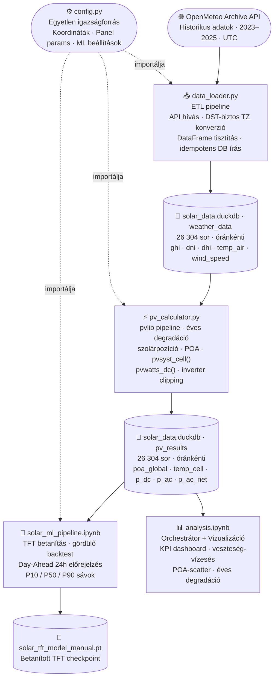

<a id="teteje"></a>

# Solar ML Pipeline
> (`solar-ml-pipeline`)

<p align="center">
  
  
  
  
  
  
  
</p>

<p align="center">
  <a href="#attekintes">Áttekintés</a> &bull;
  <a href="#architektura">Architektúra</a> &bull;
  <a href="#parameterek">Paraméterek</a> &bull;
  <a href="#ml-modell">ML Modell</a> &bull;
  <a href="#setup">Setup</a> &bull;
  <a href="#struktura">Struktúra</a> &bull;
  <a href="#megvalasztott">Megválasztott értékek</a> &bull;
  <a href="#dontes">Technikai döntések</a> &bull;
  <a href="#kihivas">Kihívások</a> &bull;
  <a href="#kapcsolat">Kapcsolat</a>
</p>

<p align="center">
  ☀️ Napenergia ETL, fizikai szimuláció és Deep Learning alapú másnapi termelés-előrejelzés – OpenMeteo-tól a probabilisztikus TFT modellezésig.
</p>

---

<a id="attekintes"></a>
## Áttekintés

Ez a projekt egy napelemes adatfeldolgozó (ETL) és fizikai szimulációs pipeline kiterjesztése egy **Day-Ahead (másnapi) termelés-előrejelző Deep Learning modellel**. A cél egy Python alapú rendszer felépítése, amely meteorológiai adatokat tölt le, fizikailag szimulál egy valós napelemrendszert, majd az eredményeket Temporal Fusion Transformer (TFT) modellel másnapi, valószínűségi előrejelzésre használja fel.

A projekt **két Jupyter Notebook** köré szerveződik, amelyeket a közös DuckDB adatbázis köt össze:

1. **ETL + Szimulációs Notebook** (`analysis.ipynb`): Historikus időjárási adatok (irradiancia, hőmérséklet, szélsebesség) letöltése az OpenMeteo API-ból 3 évre (2023–2025), pvlib-alapú napelemrendszer-szimuláció inverter clippinggel és éves degradációval, az eredmények mentése DuckDB-be (`p_ac_net`), valamint részletes vizualizáció.

2. **ML Pipeline Notebook** (`solar_ml_pipeline.ipynb`): A DuckDB-ből kinyert adatok alapján TFT modell betanítása és gördülő (rolling) másnapi előrejelzés a 2025-ös teszt évre, P10/P50/P90 bizonytalansági sávokkal.

**Helyszín:** Debrecen, Déli Gazdasági Övezet · **Időszak:** 2023–2025 · **Rendszer:** 10 × Jinko Tiger Neo 430Wp, 3 kW inverter (ILR = 1,43)

---

<a id="architektura"></a>
## Architektúra



**Separation of Concerns:** a két notebook kizárólag a DuckDB adatbázison keresztül kommunikál. Az ML notebook nem foglalkozik ETL-lel, az ETL notebook nem tartalmaz ML kódot.

---

<a id="parameterek"></a>
## Napelem Rendszer Paraméterei

| Paraméter | Érték | Forrás |
|---|---|---|
| Panel típus | Jinko Solar Tiger Neo N-type 54HL4R-B | Adatlap |
| Névleges teljesítmény | 430 Wp / panel | Adatlap (STC) |
| Panelek száma | 10 db | – |
| Összes DC teljesítmény | 4 300 Wp | 10 × 430 W |
| Modul hatásfok | 22,02 % | Adatlap |
| Hőmérsékleti együttható | −0,30 %/K (N-típus) | Adatlap |
| Dőlésszög | 30° | – |
| Tájolás | 180° (dél) | Optimális, északi félgömb |
| Inverter max. AC teljesítmény | 3 000 W | – |
| Inverter Loading Ratio (ILR) | 4 300 / 3 000 = **1,43** | Clipping! |
| Inverter hatásfok | 96 % | Iparági tipikus |
| Degradáció – 1. év | −1,0 % | Jinko adatlap |
| Degradáció – 2+ év | −0,4 % / év | Jinko adatlap |

---

<a id="ml-modell"></a>
## ML Modell – Temporal Fusion Transformer (TFT)

### Miért TFT?

A Temporal Fusion Transformer nemcsak pontbecslést, hanem ipari szintű **valószínűségi előrejelzést** (P10/P50/P90 kvantilisek) ad. Képes kezelni a hosszú-távú szezonális mintázatokat (éves ciklus), a rövid-távú időjárási ingadozásokat, és az inverter clippingből adódó nemlineáris viselkedést.

### Architektúra és Hiperparaméterek

| Paraméter | Érték | Magyarázat |
|---|---|---|
| **Könyvtár** | Darts | Gyors prototipizálás, beépített TFT, backtesting API |
| **Encoder (input) ablak** | 168 óra (7 nap) | Heti mintázatok rögzítéséhez elegendő |
| **Decoder (output) ablak** | 24 óra (1 nap) | Day-ahead előrejelzés |
| **Hidden size** | 64 | |
| **LSTM rétegek** | 2 | |
| **Attention fejek** | 4 | |
| **Likelihood** | QuantileRegression | P10 / P50 / P90 |
| **Epochok** | 20 | Korai leállítással |

### Adatfelosztás

| Halmazhoz | Időszak | Sorok | Cél |
|---|---|---|---|
| **Train** | 2023-01-01 – 2024-09-30 | 15 334 h | Mintázatok megtanulása |
| **Validáció** | 2024-10-01 – 2024-12-31 | 2 209 h | Korai leállítás alapja |
| **Test** | 2025-01-01 – 2025-12-31 | 8 760 h | Gördülő day-ahead backtest |

### Célváltozó és Bemenetek

- **Target:** `p_ac_net` – a hálózatra betáplált végső AC teljesítmény (degradációval és rendszerveszteségekkel csökkentve)
- **Past Covariates:** historikus `p_ac_net`, `ghi`, `temp_air`, `wind_speed`
- **Future Covariates:** `hour_sin`, `hour_cos`, `month_sin`, `month_cos` (ciklikus kódolás)

### Day-Ahead Gördülő Backtest (2025)

A modell úgy végzi a kiértékelést, ahogyan egy valós üzemeltetési rendszer működne: minden nap éjfélkor a megelőző 7 nap adatai alapján megjósolja a következő 24 óra termelését. Ez 365 egymást követő day-ahead előrejelzést jelent.

### Eredmények

| Metrika | Érték | Megjegyzés |
|---|---|---|
| **RMSE** | **46,88 W** | Minden 2025-ös óra |
| **MAPE** | **9,38 %** | Csak nappali órák (p_ac_net > 5 W) |

### Vizualizációk

- **Véletlenszerű heti ablak:** P10/P50/P90 sávok vs. valós termelés
- **Havi × Óránkénti hőtérkép:** tényleges vs. P50 vs. abszolút hiba – a clipping és a szezonalitás jól látható
- **Napi MAPE naptár:** 365 napos hőtérkép – zöld (pontos) → piros (felhős/bizonytalan) → szürke (téli, nincs termelés)

---

<a id="setup"></a>
## Telepítés és Futtatás (Setup)

### Opció 1: Conda környezet (Ajánlott)

```bash
conda env create -f environment.yml
conda activate solar_env
```

### Opció 2: Standard Python (venv + pip)

```bash
python -m venv venv

# Windows:
venv\Scripts\activate
# Linux / macOS:
source venv/bin/activate

pip install -r requirements.txt
```

> **Megjegyzés:** A `darts` csomag és PyTorch függőségei automatikusan települnek a `requirements.txt`-ből. GPU használathoz a PyTorch CUDA verziója külön telepítendő.

### Futtatás

**1. lépés – ETL + Szimuláció:**

```bash
jupyter notebook analysis.ipynb
```

A notebook sorban elvégzi az adatletöltést (OpenMeteo API, 2023–2025), a pvlib szimulációt degradációval és clippinggel, elmenti az eredményeket DuckDB-be, majd megjeleníti a vizualizációkat.

**2. lépés – ML Pipeline:**

```bash
jupyter notebook solar_ml_pipeline.ipynb
```

A notebook rácsatlakozik a DuckDB adatbázisra, betanítja (vagy betölti) a TFT modellt, lefuttatja a gördülő 2025-ös backtestet, és kirajzolja az eredményeket. Ha a `solar_tft_model_manual.pt` checkpoint már létezik, az újratanítás kihagyható.

---

<a id="struktura"></a>
## Projekt Struktúra

<pre>
solar-ml-pipeline/
├── <a href="config.py">config.py</a>                        # Minden konstans egy helyen (koordináták, panel, ML beállítások)
├── <a href="data_loader.py">data_loader.py</a>                   # OpenMeteo API → DuckDB ETL pipeline (multi-év, DST-biztos)
├── <a href="pv_calculator.py">pv_calculator.py</a>                 # DuckDB → pvlib → p_ac_net (degradációval, clippinggel)
├── <a href="analysis.ipynb">analysis.ipynb</a>                   # 1. notebook: ETL orchestrátor + pvlib + vizualizáció
├── <a href="solar_ml_pipeline.ipynb">solar_ml_pipeline.ipynb</a>          # 2. notebook: TFT betanítás + day-ahead backtest + viz
├── solar_tft_model_manual.pt        # 🔒 Betanított TFT modell (gitignore-ban)
├── solar_tft_model_manual.pt.ckpt   # 🔒 Darts checkpoint artifact (gitignore-ban)
├── darts_logs/                      # 🔒 Tanítási logok, epoch checkpointok, backtest cache
│   └── backtest_scaled.pkl          #    Gördülő backtest cache (365 nap)
├── solar_data.duckdb                # 🔒 Generált DuckDB adatbázis (gitignore-ban)
├── environment.yml                  # Conda függőségek (verziópinelt)
├── requirements.txt                 # pip függőségek (verziópinelt)
├── .python-version                  # Python verzió rögzítése (3.10)
├── .gitignore                       # Adatbázis, modellfájlok, cache kizárása
└── README.md
</pre>

**Konfiguráció elvének magyarázata:** minden „magic number" és beállítás a `config.py`-ban van definiálva, adatlapra hivatkozó kommentekkel. A két notebook és a Python modulok ebből importálnak, így a rendszer egyetlen helyen auditálható és módosítható.

---

<a id="megvalasztott"></a>
## Megválasztott Alapértelmezett Értékek

### Helyszín és meteorológia

| Paraméter | Érték | Indoklás |
|---|---|---|
| **Város** | Debrecen, Déli Gazdasági Övezet | Valós ipari/gyári környezet szimulálása |
| **Koordináták** | 47,4728°N / 21,6145°E / 121 m | WGS84; a DGÖ középpontja |
| **Időzóna** | Europe/Budapest (UTC+1/+2) | Magyarország zónája |
| **Meteorológiai adatok** | OpenMeteo Archive API, UTC | Nyílt forráskódú, ingyenes, DST-biztos, óránkénti felbontás |
| **Időszak** | 2023–2025 (3 év) | 2 év train + 1 év test |

### Napelem park mechanikai paraméterei

| Paraméter | Érték | Indoklás |
|---|---|---|
| **Dőlésszög (tilt)** | 30° | ~47°N szélességen optimális éves hozamhoz |
| **Tájolás (azimuth)** | 180° (déli) | Északi félgömbön az elméleti optimum |

### Napelem paraméterek (Jinko Solar Tiger Neo N-type 54HL4R-B, adatlap-alapú)

| Paraméter | Érték | Indoklás |
|---|---|---|
| **Névleges teljesítmény** | 430 Wp / panel | Adatlap (STC: 1000 W/m², 25 °C, AM 1.5) |
| **Panelek száma** | 10 db | 4,3 kWp összteljesítmény |
| **Össz DC teljesítmény** | 4 300 Wp | 10 × 430 W |
| **Modul hatásfok** | 22,02 % | Adatlap (N-típusú, magasabb, mint P-típusnál) |
| **Hőmérsékleti együttható** | −0,30 %/K | Adatlap; N-típusnál kedvezőbb, mint a P-típus ~−0,34 %/K |

### Degradáció (Jinko adatlap alapján)

| Paraméter | Érték | Indoklás |
|---|---|---|
| **1. év degradáció** | −1,0 % | LID (Light-Induced Degradation) + kezdeti veszteség |
| **Éves degradáció (2+ év)** | −0,4 % / év | Jinko Tiger Neo adatlapból; N-típusnál alacsonyabb a P-típus ~0,55 %/év értékénél |
| **Alap (referencia) év** | 2023 | A 2023-as adatok 100%-os teljesítményből indulnak |

A degradáció **vektorizáltan**, időbélyegenként kerül alkalmazásra a `pv_calculator.py`-ban, és a `p_ac_net` célváltozóba van beégetve. Az ML modell ezt a lassú, monoton csökkenést implicite megtanulja.

### Cellahőmérséklet modellezés (pvlib.temperature.pvsyst_cell)

| Paraméter | Érték | Indoklás |
|---|---|---|
| **U_c (konstans hőveszteségi tényező)** | 28,77 W/m²/K | Jinko adatlap (NOCT = 41 °C): `U_c = 800 × (1 − η_m/α) / (T_NOCT − 20) = 800 × 0,755 / 21` |
| **U_v (szél-függő tag)** | 0,0 Ws/m³/K | Lapostetős ballasztos szerkezet → minimális szélhűtés |
| **Elnyelt sugárzás aránya** | α = 0,9 | pvlib alapértelmezés |

### Inverter paraméterek

| Paraméter | Érték | Indoklás |
|---|---|---|
| **Maximális AC teljesítmény** | 3 000 W | Határozott clippinget okoz nyáron (ILR = 1,43) |
| **Inverter Loading Ratio (ILR)** | 4 300 / 3 000 = **1,43** | Szándékos túlterhelés → nyári clipping → változatos tanítóadat az ML-nek |
| **Névleges inverter hatásfok** | 96,0 % | Iparági tipikus érték |

### Rendszerveszteség modell (NREL PVWatts v5 alap)

A veszteségek **multiplikatívan** hatnak: `derate_factor = ∏(1 − loss_i)` ≈ **0,8679**, teljes veszteség **~13,21 %**.

| Komponens | Érték | Indoklás |
|---|---|---|
| Koszolódás (soiling) | 2,0 % | NREL PVWatts v5 alapérték |
| Árnyékolás (shading) | 3,0 % | NREL PVWatts v5 alapérték |
| Modul-eltérés (mismatch) | 2,0 % | NREL PVWatts v5 alapérték |
| DC kábelezés (wiring) | 2,0 % | NREL PVWatts v5 alapérték |
| Csatlakozási veszteség (connections) | 0,5 % | NREL PVWatts v5 alapérték |
| Fény okozta degradáció (LID) | 1,5 % | NREL PVWatts v5 alapérték |
| Rendelkezésre állás (availability) | 3,0 % | NREL PVWatts v5 alapérték |
| **Teljes derate faktor** | ~86,79 % | Multiplikatív: (1−0,02)(1−0,03)(1−0,02)²(1−0,005)(1−0,015)(1−0,03) |

### Adatbázis és technológia

| Paraméter | Érték | Indoklás |
|---|---|---|
| **Adatbázis** | DuckDB (`solar_data.duckdb`) | Column-oriented, fájlalapú, deployment-mentes; natív TIMESTAMPTZ, közvetlen DataFrame I/O |
| **ML könyvtár** | Darts | Magas szintű TFT API, beépített backtesting, TimeSeries absztrakció |
| **Python verzió** | 3.10 | Stabil; minden függőség (pvlib, darts, duckdb) támogatja |

---

<a id="dontes"></a>
## Technikai Döntések és Indoklások

### POA irradiancia modell: `haydavies`

| Modell | Szórt sugárzás kezelése | Pontosság | Komplexitás |
|---|---|---|---|
| `isotropic` | Egyenletes égbolteloszlás | Alacsonyabb, felhős égboltnál | Minimális |
| **`haydavies`** | **Circumsolar + horizont fényerősödés** | **Közepes-jó** | **Mérsékelt** |
| `perez` | Teljes anizotrop empirikus modell | Legjobb | Magas |

Debrecen kontinentális éghajlatán a `haydavies` pontosabb az `isotropic`-nál. A `perez`-zel szemben az éves energiahozam szintjén várható eltérés 1–3 %, ami egy prototípus-szintű implementációban nem indokolja a plusz komplexitást.

### Adatbázis: DuckDB (SQLite + SQLAlchemy ORM helyett)

| Szempont | SQLite + SQLAlchemy ORM | DuckDB |
|:---|:---|:---|
| **Tárolási architektúra** | Row-oriented | Column-oriented — GROUP BY, aggregáció, szűrés lényegesen gyorsabb |
| **Timestamp típus** | `VARCHAR` ISO 8601 (string) | `TIMESTAMPTZ` — natív, UTC-ben tárolva, automatikus konverzió |
| **DataFrame → DB írás** | Soronkénti ORM objektum + `Session.add_all()` | Replacement Scan: Python változó neve közvetlenül SQL-ben hivatkozható |
| **DB → DataFrame olvasás** | `pd.read_sql()` + kézi `pd.to_datetime(..., utc=True)` | `.execute("...").df()` — egy hívás, típushelyes eredmény |
| **ORM réteg** | ~80 sor boilerplate | Nem szükséges |
| **Deployment** | Fájlalapú, nincs szerver | Fájlalapú, nincs szerver |

### TFT vs. egyéb modellek

| Modell | Erősség | Gyengeség |
|---|---|---|
| **TFT (Darts)** | Probabilisztikus (P10/P50/P90), szezonalitás, hosszú függőségek | Lassabb tanítás CPU-n |
| LSTM | Egyszerű, gyors | Csak pontbecslés, nincs bizonytalansági sáv |
| Prophet | Gyors, értelmező | Nem kezeli jól a fizikai korlátokat (clipping) |
| XGBoost | Gyors, pontbecslés | Nincs natív temporal ablak, nincs probabilisztikus kimenet |

A TFT választásának fő indoka: a **valószínűségi kimenet** (bizonytalansági sávok) ipari szinten elengedhetetlen a napelempark termelésének tervezéséhez – egy döntéshozónak nem elég a várható érték, tudnia kell a pesszimista (P10) és optimista (P90) szcenáriót is.

### Cellahőmérséklet modell: pvsyst_cell (U_v = 0)

A lapostetős ballasztos szerkezetben a szél hűtőhatása minimális az aerodinamikai kialakítás miatt. Az `u_v=0.0` érték realisztikusan szimulálja a tetőn megrekedő hőt, ami magasabb cellahőmérsékletet és ezáltal alacsonyabb termelést eredményez – konzervatív, de fizikailag indokolt feltételezés.

---

<a id="kihivas"></a>
## Fejlesztés Során Felmerült Kihívások

<details>
<summary>💡 DST-kezelés: NonExistentTimeError és AmbiguousTimeError</summary>

> Az OpenMeteo API alapértelmezésben lokális időzónában adja vissza az adatokat, ami két problémát okoz évenként:
>
> - **Tavaszi átmenet (március utolsó vasárnapja):** a `02:00` timestamp fizikailag nem létezik `Europe/Budapest`-ben – `NonExistentTimeError`
> - **Őszi átmenet (október utolsó vasárnapja):** a `02:xx` tartomány kétszer szerepel – `AmbiguousTimeError`
>
> **Megoldás:** az API-t `timezone="UTC"` paraméterrel hívjuk. A `_build_dataframe()`-ben `tz_localize("UTC")` → `tz_convert("Europe/Budapest")` konverzió garantál helyes eredményt.

</details>

<details>
<summary>💡 UTC → CET konverzió: 2026-01-01 00:00 szivárgás a grafikonokba</summary>

> A 3-éves adatsor utolsó UTC-s timestampje `2025-12-31 23:00 UTC`. CET-re konvertálva ez `2026-01-01 00:00 CET`, ami bekerül a DataFrame-be és az `all_years` listába. Ennek következménye: a grafikonokon megjelennek a 2026-os szolsztíciusz-jelölők (NYnf 2026, TÉnf 2026), és a tengelyek `END_DATE` utánra nyúlnak.
>
> **Megoldás:** a `daily_kwh` és `rolling_14` sorozatokat az `END_DATE` (`config.py`-ból importálva) alapján levágjuk a vizualizációs cellában:
> ```python
> _end_ts = pd.Timestamp(END_DATE).tz_localize(TIMEZONE)
> daily_kwh  = daily_kwh[daily_kwh.index <= _end_ts]
> rolling_14 = rolling_14[rolling_14.index <= _end_ts]
> all_years  = sorted(daily_kwh.index.year.unique())
> ```

</details>

<details>
<summary>💡 Multi-év adatletöltés: szökőév-tudatos sorellenőrzés</summary>

> Az eredeti pipeline egyetlen évre (8 760 sor) volt méretezve. 3 évre kibővítve (2023–2025) a sorellenőrzésnek szökőévenként (2024: 8 784 sor) eltérő elvárással kell dolgoznia. A `data_loader.py` évenként futtatja az API-hívást, és az `expected_rows()` segédfüggvénnyel szökőév-tudatosan ellenőrzi a letöltött sorok számát.

</details>

<details>
<summary>💡 pvlib verziókompatibilitás: eta_m → module_efficiency</summary>

> A `pvlib.temperature.pvsyst_cell()` paraméterneve korábbi verzióban `eta_m` volt, a `0.15.x`-ben `module_efficiency`. A hiba csak futásidőben, `TypeError`-ként jelentkezett. Ellenőrzési módszer: `inspect.signature(pvlib.temperature.pvsyst_cell)`.

</details>

<details>
<summary>💡 haydavies modell: kötelező dni_extra paraméter</summary>

> A `pvlib.irradiance.get_total_irradiance()` `haydavies` modellel hívva `ValueError`-t dob, ha a `dni_extra` paraméter hiányzik. Az `isotropic` modellnél ez opcionális, ezért nem volt nyilvánvaló. A `dni_extra` nem mérési adat – `pvlib.irradiance.get_extra_radiation(df.index)` számítja a Nap–Föld távolság alapján.

</details>

<details>
<summary>💡 Darts TimeSeries: timezone-naive kötelezettség</summary>

> A Darts `TimeSeries.from_dataframe()` timezone-aware indexet nem fogad el; `ValueError`-t dob. Az `Europe/Budapest` timezone-aware DataFrame indexet UTC-re kell konvertálni, majd `tz_localize(None)`-nal timezone-naive-vé tenni, mielőtt Darts `TimeSeries`-be kerül. A visszakonverzió a vizualizációs lépésben szükséges.

</details>

<details>
<summary>💡 DuckDB kapcsolatkonfliktus: „Can't open connection with different configuration"</summary>

> A DuckDB fájlalapú adatbázishoz egyidejűleg nem nyitható írható és `read_only=True` kapcsolat. Ez akkor okoz hibát, ha `run_pv_simulation()` megtartja az írható kapcsolatot, miközben `get_weather_dataframe()` `read_only=True`-val próbálja megnyitni ugyanazt a fájlt.
>
> **Megoldás:** a `run_pv_simulation()` az init/ellenőrzési fázist egy rövid életű `with duckdb.connect(db_path) as con:` blokkban végzi el (ami a blokk végén automatikusan bezárul), majd az eredmény mentéséhez nyit egy új írható kapcsolatot.

</details>

---

## Státusz

- [x] Projekt struktúra, repó és környezet felállítása
- [x] `config.py` – összes paraméter frissítve (Debrecen, Jinko 430Wp, 3 kW inverter, 30°, 2023–2025, degradáció, ML beállítások)
- [x] `data_loader.py` – multi-év (2023–2025) támogatás, szökőév-tudatos sorellenőrzés
- [x] `pv_calculator.py` – `p_ac_net` mentése DuckDB-be, éves degradációs faktor vektorizálva, `ALTER TABLE` migráció, inverter clipping
- [x] `analysis.ipynb` – újrafuttatva (force_reload=True); 26 304 sor DuckDB-ben, éves termelés: 2023: 5 247 kWh, 2024: 5 496 kWh, 2025: 5 307 kWh
- [x] `solar_ml_pipeline.ipynb` – TFT betanítás és gördülő day-ahead backtest (2025), RMSE 46,88 W, MAPE 9,38 % (nappali)
- [x] Vizualizációk: heti P10/P50/P90 sávok, havi×óránkénti hőtérkép, napi MAPE naptár

---

<a id="kapcsolat"></a>
## Kapcsolat

* **Weboldal:** [csabatatrai.hu](https://csabatatrai.hu/)
* **LinkedIn:** [linkedin.com/in/csabatatrai-datascientist](https://www.linkedin.com/in/csabatatrai-datascientist/)
* **E-mail:** [tatraicsababprof@gmail.com](mailto:tatraicsababprof@gmail.com)

---

<div align="center">
  © 2026 Tátrai Csaba Attila
  <br><br>
  <a href="#teteje">
    
  </a>
</div>
